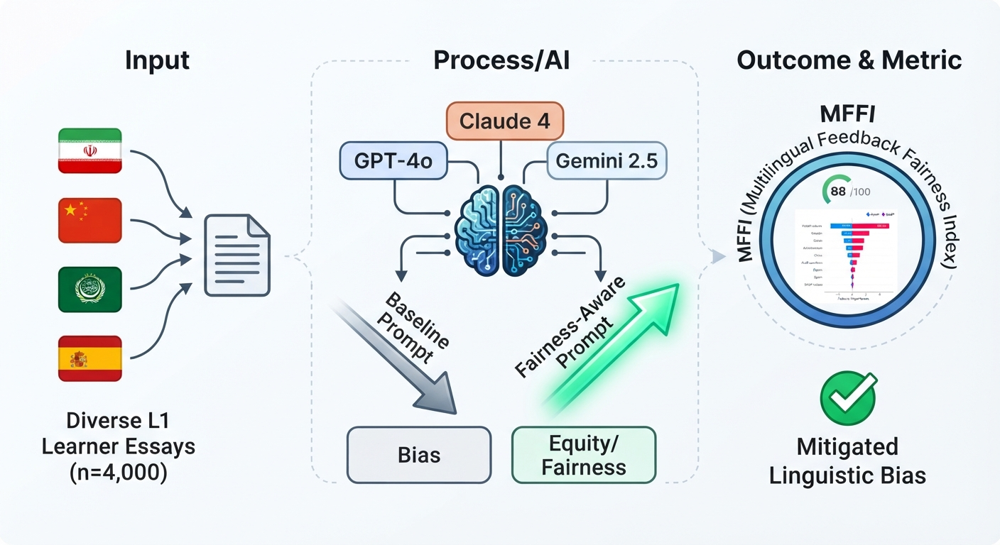

# Evaluating Cross-Linguistic Fairness in LLM-Generated Writing Feedback for Multilingual EFL Learners



## Overview
This repository contains the replication package, benchmarking framework, and analysis scripts for the study titled *"Evaluating Cross-Linguistic Fairness in Large Language Model-Generated Writing Feedback for Multilingual EFL Learners."* 

Our research investigates the performance gaps of Large Language Models (LLMs) across different linguistic backgrounds (Arabic, Chinese, Persian, Spanish) and proposes a novel framework to measure fairness in AI-generated pedagogical feedback.

## Key Frameworks & Indices
We introduce two primary indices to quantify algorithmic bias and performance disparity:
*   **FQI (Fairness Quality Index):** Measures the consistency of feedback quality across proficiency levels.
*   **MFI (Multilingual Fairness Index):** Evaluates the uniformity of model performance across diverse L1 backgrounds.

## Directory Structure
```text
.
├── data/                 # Raw datasets and data_dictionary.md
├── docs/                 # Supplementary documentation
├── figures/              # Plots and visualizations (including ga2.png)
├── notebooks/            # Jupyter notebooks for statistical analysis
├── results/              # Output tables, statistical logs, and test results
│   ├── statistical_tests/ # MANOVA and Tukey HSD statistical outputs
│   ├── tables/           # Aggregated numerical reports
│   ├── figures/          # Saved publication-ready plots
│   └── logs/             # Preprocessing and analysis logs
├── src/                  # Core Python scripts (metrics.py, analyze.py)
├── .gitignore            # Git configuration
└── requirements.txt      # Dependencies
