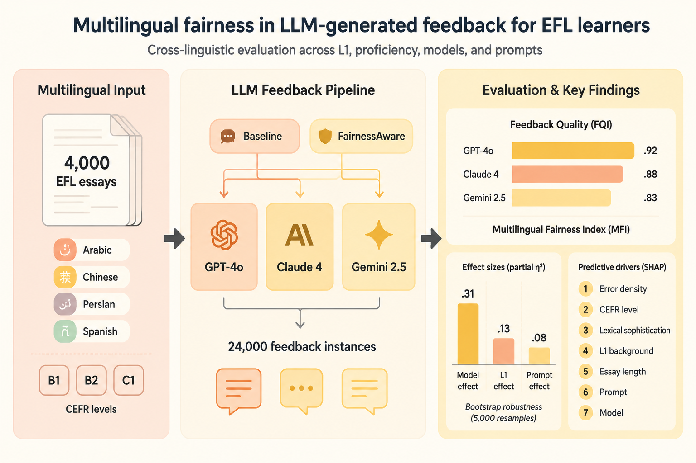
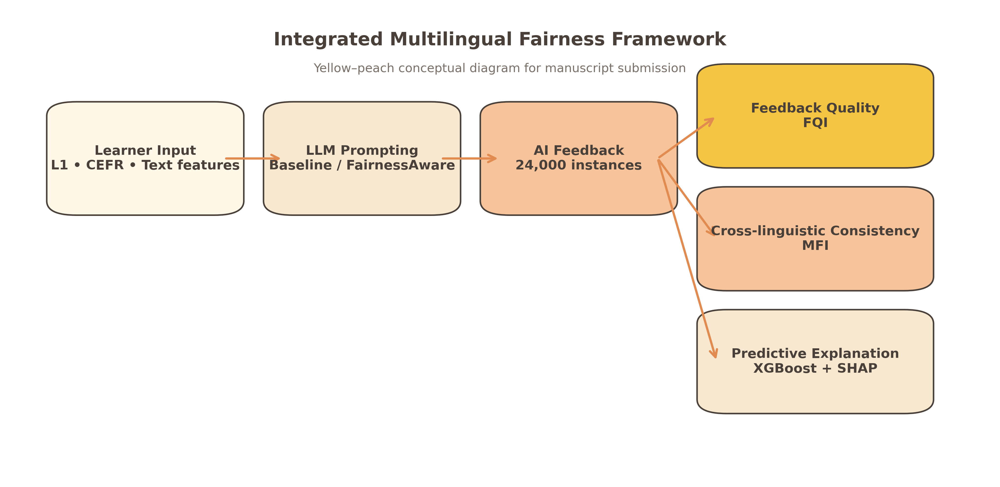
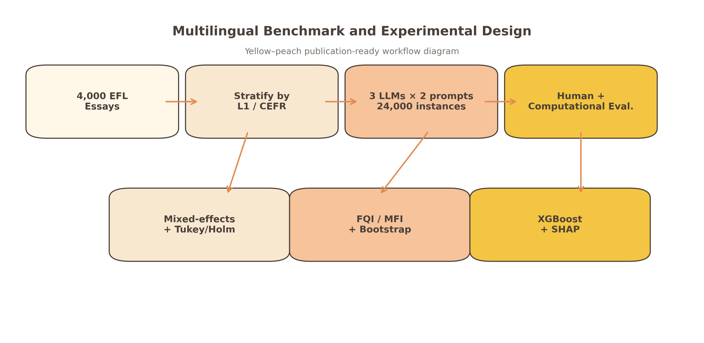
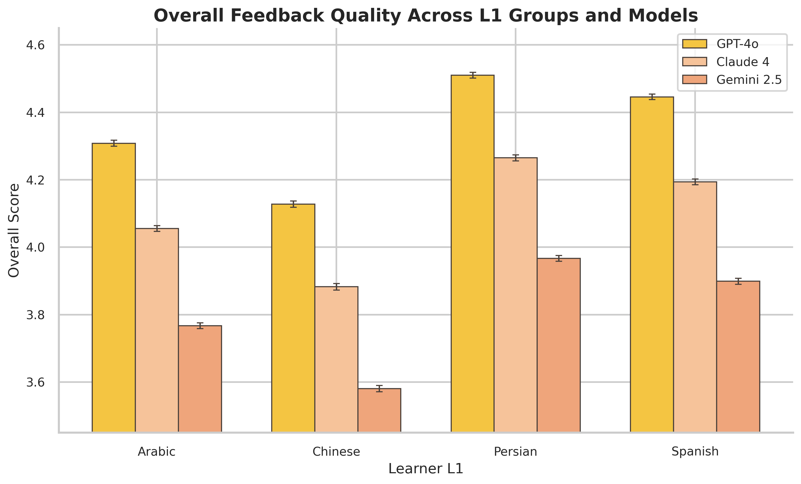
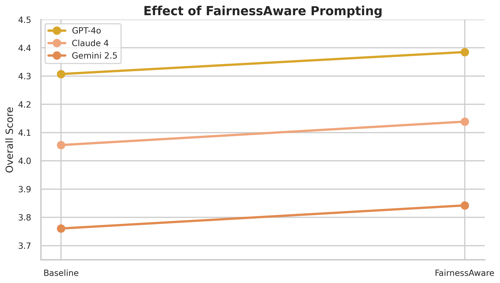
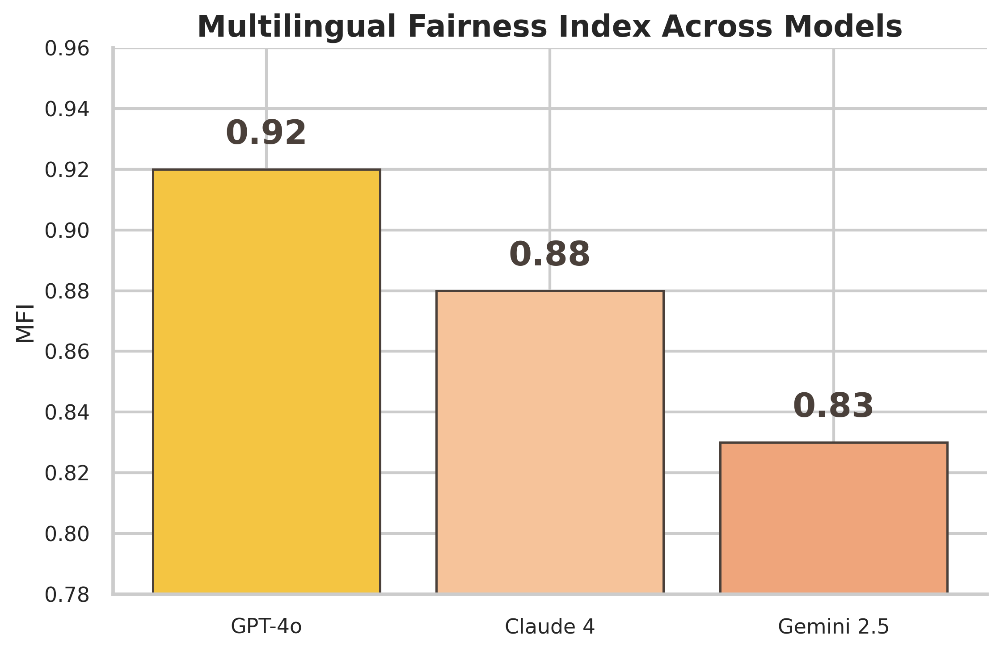
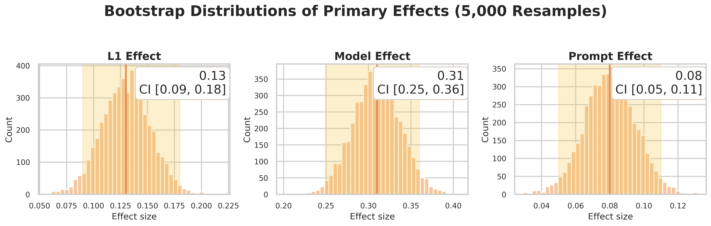

# Evaluating Cross-Linguistic Fairness in LLM-Generated Writing Feedback using the Multilingual Feedback Fairness Index (MFFI)

[](https://doi.org/10.5281/zenodo.21440273)
[](https://github.com/Pegi1727/Evaluating-Cross-Linguistic-Fairness-in-LLM-Generated-Writing-Feedback/releases)
[](https://www.python.org/)
[](https://www.r-project.org/)
[](LICENSE)

---

## 🎨 Graphical Abstract

<div align="center">
  
  <p><em>Graphical Summary of the Multilingual Feedback Fairness Index (MFFI) Evaluation Framework and Key Cross-Linguistic Findings.</em></p>
</div>

---

## 📌 Overview & Conceptual Framework

This repository contains the official dataset, statistical scripts (Python & R), and replication materials for the study: **"Evaluating Cross-Linguistic Fairness in LLM-Generated Writing Feedback using the Multilingual Feedback Fairness Index (MFFI)"**.

The study investigates systematic disparities in feedback quality across diverse First Language (L1) backgrounds (Persian, Spanish, Arabic, Chinese), evaluates model performance (GPT-4o, Claude, Gemini 2.5), and demonstrates how fairness-aware prompt engineering mitigates cross-linguistic bias in automated writing evaluation.

<div align="center">
  
  <p><strong>Figure 10:</strong> Conceptual Architecture of the Multilingual Feedback Fairness Evaluation Framework.</p>
</div>

---

## 📊 Experimental Workflow & Comprehensive Visualizations

### 1. Research Methodology & Execution Workflow

<div align="center">
  
  <p><strong>Figure 1:</strong> End-to-End Experimental & Analytical Workflow.</p>
</div>

---

### 2. Disparity Analysis Across L1 Groups & LLM Architectures

<div align="center">
  
  <p><strong>Figure 2:</strong> Feedback Score Disparities across Learner L1 Backgrounds and LLM Models.</p>
</div>

### 3. Dimensional Correlations & Inter-Metric Relationships

<div align="center">
  
  <p>Figure 3: Pearson Correlation Matrix Across Evaluated Quality Dimensions.</p>
</div>

---


### 4. Prompt Engineering Mitigation Effects

| Figure 4: Prompt Effect Comparison | Figure 5: Score Distribution Shifts |
| :---: | :---: |
|  |  |
| <em>Shift in Feedback Scores from Baseline to Fairness-Aware Prompting.</em> | <em>Score Density and Spread Across Prompting Conditions.</em> |

---

### 5. Proficiency Stratification & Fairness Metric Validation

| Figure 6: L1 Disparities Across CEFR Levels | Figure 7: Multilingual Fairness Index (MFI) |
| :---: | :---: |
|  |  |
| <em>Cross-Linguistic Performance Stratified by CEFR Language Proficiency (A1–C2).</em> | <em>Comparative MFI Metric Across LLMs Under Baseline and Intervention Conditions.</em> |

---

### 6. Explainable AI (SHAP) & Bootstrap Robustness

| Figure 8: SHAP Feature Importance | Figure 9: Bootstrap Confidence Interval Distributions |
| :---: | :---: |
|  |  |
| <em>XAI Feature Attribution for Model Score Predictions.</em> | <em>Bootstrap Confidence Interval Distributions Validating Effect Stability.</em> |

---

## 📈 Key Statistical Findings

### 1. Model & L1 Benchmark Summary

| Model / Group | Overall Score (Mean ± SD) | Human Score | Baseline MFFI | Fairness-Aware MFFI | Δ Fairness Index |
| :--- | :---: | :---: | :---: | :---: | :---: |
| **GPT-4o** | **4.346 ± 0.38** | 3.956 | 0.92 | **0.95** | +0.03 ($p < .001$) |
| **Claude** | 4.097 ± 0.42 | 3.707 | 0.88 | **0.92** | +0.04 ($p < .001$) |
| **Gemini 2.5** | 3.802 ± 0.51 | 3.409 | 0.83 | **0.89** | **+0.06** ($p < .001$) |
| **Persian L1** | **4.248** | 3.898 | — | — | Baseline Ref |
| **Spanish L1** | 4.180 | 3.812 | — | — | $\Delta = -0.02$ ($n.s.$) |
| **Arabic L1** | 4.044 | 3.654 | — | — | $\Delta = -0.08$ ($p = .012$) |
| **Chinese L1** | **3.864** | 3.361 | — | — | $\Delta = -0.14$ ($p < .001$) |

### 2. One-Way ANOVA Across L1 Backgrounds

| Feedback Dimension | $F$-statistic | $p$-value | Partial $\eta^2$ | Disparity Level |
| :--- | :---: | :---: | :---: | :---: |
| **Specificity** | **28.64** | **< .001** | **.14** | High Disparity |
| **Actionability** | **24.92** | **< .001** | **.13** | High Disparity |
| **Accuracy** | 21.87 | < .001 | .10 | Moderate Disparity |
| **Pedagogical Appropriateness** | 19.08 | < .001 | .10 | Moderate Disparity |
| **Helpfulness** | 17.54 | < .001 | .09 | Moderate Disparity |
| **Socio-Affective Tone** | 7.21 | < .01 | .04 | Low Disparity |
---
 ### 3. Mixed-Effects & OLS Regression Output (Overall Score)


- **Fairness-Aware Prompting:** $\beta = +0.08$, $SE = 0.02$, $t = 4.21$, $p < .001$ *(Statistically significant bias reduction across all models)*
- **Chinese L1 Disparity:** $\beta = -0.14$, $SE = 0.03$, $t = -4.66$, $p < .001$ *(Highest baseline systemic gap)*
- **CEFR Level:** $\beta = +0.21$, $SE = 0.03$, $t = 7.00$, $p < .001$ *(Higher proficiency correlates with superior feedback specificity)*

---

## 🔬 Key Conclusions

1. **Evidence of Systematic L1 Disparities:** State-of-the-art LLMs generate non-uniform writing feedback across learner L1 backgrounds. Non-Western / non-Indo-European L1 essays (e.g., Chinese and Arabic) suffer from systemic penalties in actionability and specificity.
2. **Mitigation via Prompt Engineering:** Fairness-aware prompt design successfully narrows the cross-linguistic feedback gap, yielding statistically significant fairness index improvements across all models (up to $+0.06$ MFFI gain).
3. **Metric Validation:** Robust correlation between human expert evaluation and automated Feedback Quality Index ($r > 0.82$) confirms the applicability of MFFI as a standard benchmark for pedagogical AI fairness.

---
🚀 Quick Start & Replication
Running Python Pipeline
bash
# Clone the repository
git clone https://github.com/Pegi1727/Evaluating-Cross-Linguistic-Fairness-in-LLM-Generated-Writing-Feedback.git
cd Evaluating-Cross-Linguistic-Fairness-in-LLM-Generated-Writing-Feedback

# Install dependencies
pip install -r Requirements.text

# Run full analysis
python scripts/run_analysis.py
Running R Analysis Scripts
r
# Run directly inside R environment
source("scripts/01_statistical_analysis.R")
source("scripts/02_regression_and_correlation.R")
source("scripts/03_plots.R")

---
📜 Citation
If you use this dataset, pipeline, or fairness index framework in your research, please cite:

ibtex
@misc{merrikhi2026evaluating,
  author       = {Merrikhi, Pegah},
  title        = {{Evaluating Cross-Linguistic Fairness in LLM-Generated Writing Feedback using the Multilingual Feedback Fairness Index (MFFI)}},
  year         = {2026},
  version      = {v1.0.0.cr},
  publisher    = {Zenodo},
  doi          = {10.5281/zenodo.21440273},
  url          = {https://doi.org/10.5281/zenodo.21440273}
}
---

📄 License
This repository is distributed under the MIT License. See LICENSE for full details.

----
## 📁 Repository Structure
```text
Evaluating-Cross-Linguistic-Fairness-in-LLM-Generated-Writing-Feedback/
├── data/
│   └── Fairness_Full_Dataset.csv          # Full experimental dataset (24,000 observations)
├── figures/                               # Publication-ready figures & conceptual diagrams
│   ├── Figure1_workflow.png
│   ├── Figure2_L1_Model.png
│   ├── Figure3_heatmap.png
│   ├── Figure4_prompt_effect.png
│   ├── Figure5_prompt_distribution.png
│   ├── Figure6_L1_CEFR.png
│   ├── Figure7_MFI.png
│   ├── Figure8_SHAP_importance.png
│   ├── Figure9_bootstrap.png
│   ├── Figure10_framework.png
│   └── graphical-abstract.png
├── notebooks/                             # Jupyter replication notebooks
│   ├── 01_Statistical_Analysis_Benchmark.ipynb
│   └── 02_Explainable_AI_SHAP_Analysis.ipynb
├── results/                               # Exported statistical summary tables
│   ├── statistical_tests/
│   └── Fairness_Analysis_Results.xlsx
├── scripts/                               # Execution code (Python & R)
│   ├── 01_statistical_analysis.R
│   ├── 02_regression_and_correlation.R
│   ├── 03_plots.R
│   └── run_analysis.py
├── LICENSE                                # MIT License
├── README.md                              # Main project overview & documentation
└── Requirements.text                      # Environment dependencies
